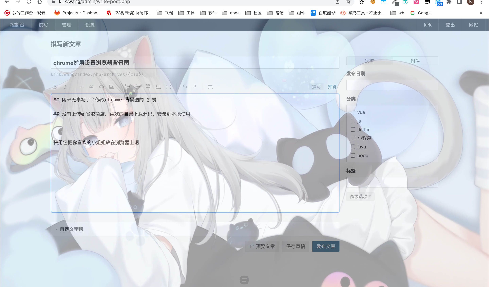
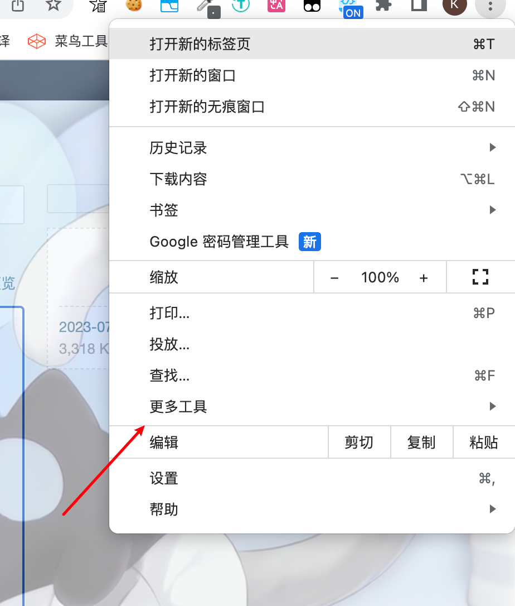
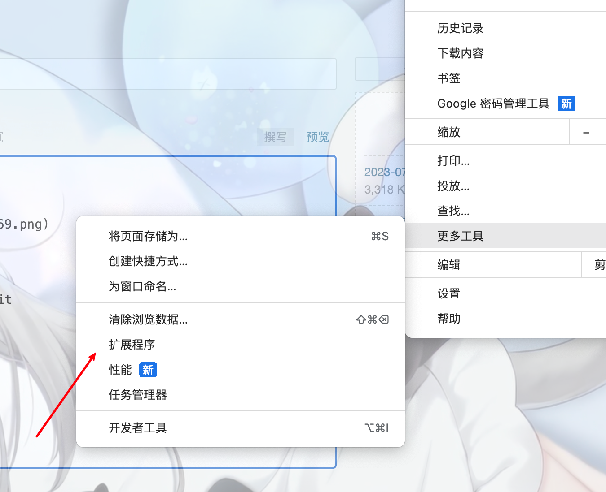
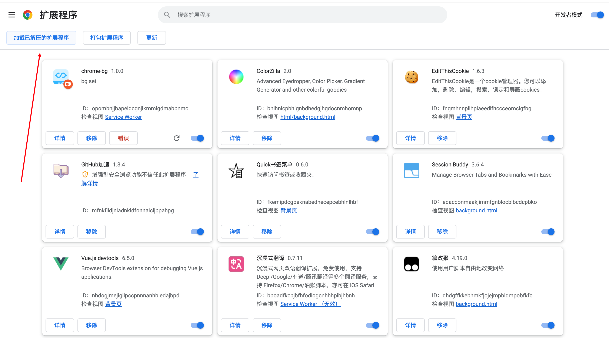
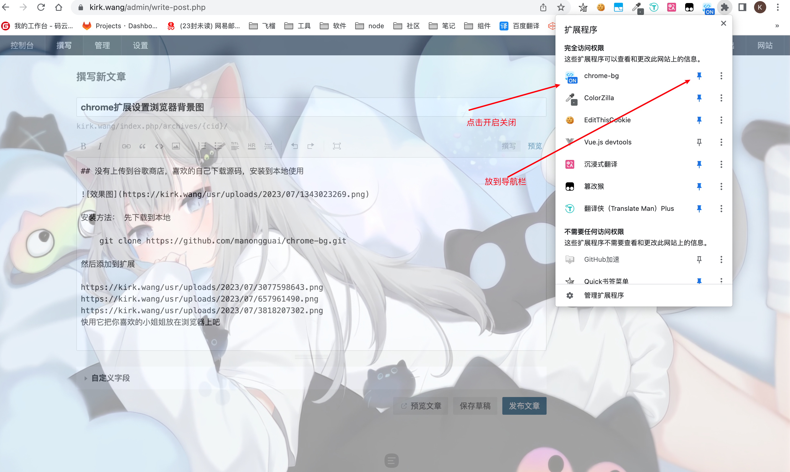
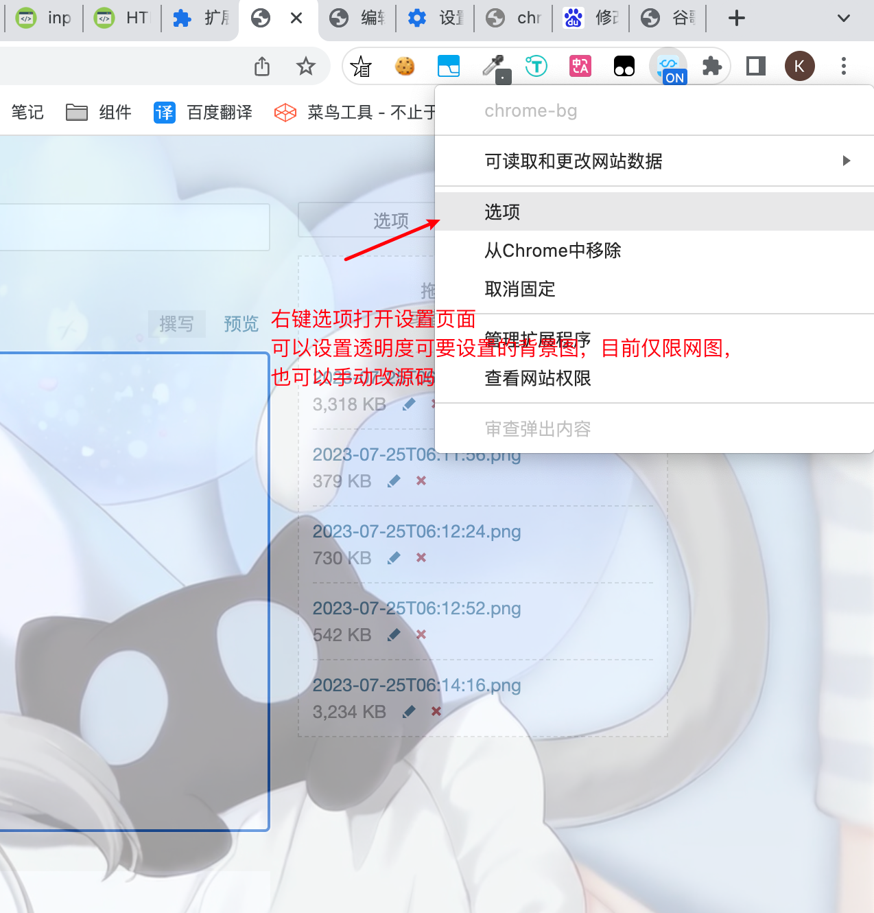

### chrome扩展设置浏览器背景图

> 闲来无事写了个修改chrome 背景图的 扩展

> 没有上传到谷歌商店，喜欢的自己下载源码，安装到本地使用

* 效果图
  

源码地址：https://github.com/manongguai/chrome-bg

* 安装方法： 先下载到本地

    git clone https://github.com/manongguai/chrome-bg.git

* 然后添加到扩展

快用它把你喜欢的小姐姐放在浏览器上吧

当然谷歌商店也有别的改背景方法，本扩展仅限学习
