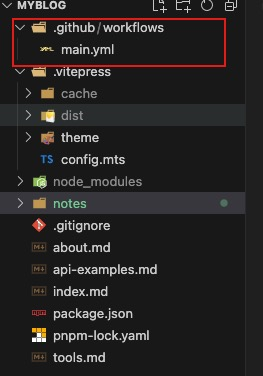

### 使用github Action前端项目自动化部署到服务器上

<br>

#### 1.创建Action

打开你的前端项目根目录，创建.github/workflows/main.yml




#### 2.编写main.yml    
> [workflows文档](https://docs.github.com/en/actions/using-workflows)


```yml
name: Build and Deploy
# 触发器，这里使用了代码push和手动触发（workflow_dispatch代表在github上添加触发按钮）
on:
  push:
    branches:
      - main
  workflow_dispatch:   

jobs:
  build:
#   运行环境
    runs-on: ubuntu-latest
    steps:
    # 使用虚拟分支
      - name: Checkout Repository
        uses: actions/checkout@v2
    #使用nodejs 
      - name: Setup Node.js
        uses: actions/setup-node@v2
        with:
          node-version: '18'
    # 安装依赖
      - name: Install pnpm
        run: npm install -g pnpm

      - name: Install Dependencies
        run: pnpm install
    # 打包
      - name: Build
        run: pnpm run docs:build
    # 发布到服务器   
      - name: Deploy to Hosting Service
        if: github.ref == 'refs/heads/main' #对分支进行检测
        uses: moonpathbg/scp_uploader@latest
        with:
          host: ${{ secrets.HOST }}
          username: ${{ secrets.USERNAME }}
          key: ${{ secrets.SSH_PRIVATE_KEY }}
          port: ${{ secrets.PORT }}
          source: "./.vitepress/dist/*"
          target: "/www/wwwroot/blog"
     

```

#### 3.配置github

上述yml 发布到服务器使用了scp uploader的方式上传文件，并且使用了ssh key的授权方式

常见的ssh授权方式有两种，一种是ssh key，另一种是密码授权

* 密码授权

Demo:
```yml
 steps:
    - uses: actions/checkout@v4
    - name: copy file via ssh password
      uses: appleboy/scp-action@v0.1.7  # scp files
      with:
        host: ${{ secrets.HOST }}
        username: ${{ secrets.USERNAME }}
        password: ${{ secrets.PASSWORD }}
        port: ${{ secrets.PORT }}
        source: "tests/a.txt,tests/b.txt"
        target: your_server_target_folder_path
```

* ssh key授权

Demo:

```yml
- name: copy file via ssh key
  uses: moonpathbg/scp_uploader@latest # scp uploader
    with:
        host: ${{ secrets.HOST }}
        username: ${{ secrets.USERNAME }}
        key: ${{ secrets.SSH_PRIVATE_KEY }}
        port: ${{ secrets.PORT }}
        source: "./.vitepress/dist/*"
        target: "/www/wwwroot/blog"
```

* 上述代码中的secrets.xxx, 是在github仓库中配置的secrets变量，配置方式如下
  
  1. 进入目标github repository,打开setting => Secrets and variables => Actions 
  2. 点击New repository secret 创建secret， 就可以在yml中引用
  

* 提交代码就可以自动进行部署，可以在 目标github repository => Actions中查看执行结果
  
  


#### 4.关于ssh key的操作流程， 很多前端同学对ssh key服务器连接不是很熟，这里有必要讲一下

1. 在本机或者任意可信任主机创建ssh key ,这里拿mac举例

```shell
 ssh-keygen -t rsa -b 4096 -C "your_email@example.com"
```
邮箱没有特殊要求，任何邮箱都可以

一直回车就创建了一个不加密的SSH密钥对，并保存为公钥为id_rsa.pub，私钥为id_rsa。

2. 查看公钥
   
```shell
cat ~/.ssh/id_rsa.pub
```
公钥要放在服务器的可信任文件authorized_keys中

可以使用ssh-copy-id直接添加进去，也可以在服务器上打开这个文件手动添加进去，但要注意格式

> 拥有被服务器添加信任ssh公钥的主机，就可以使用私钥安全的和服务器建立远程连接

```shell
ssh-copy-id -i /path/to/public-key.pub your_username@your_server_ip

```

3. 查看私钥

```shell
cat ~/.ssh/id_rsa

```
私钥是敏感信息，一般保存在计算机本地，不会向外部公开，只在ssh连接的时候进行身份认证，
但在此workflow场景下， 我们需要让github action 作为主机连接我们的服务器，因此要将私钥托管到secret中


4. 使用私钥连接远程服务器
   
```shell
ssh -i /path/to/private-key -p 22 your_username@your_server_ip
```
> 如果 SSH 服务器使用非默认的端口（22），你可以使用 -p 选项指定端口号