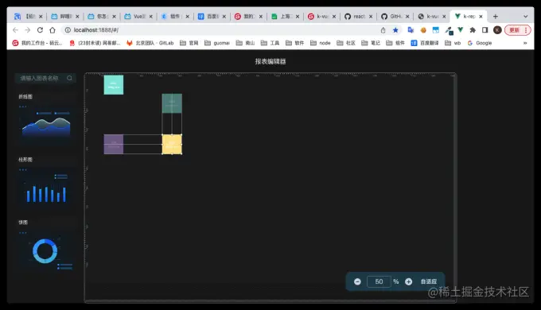

###  k-vue-dragline
* 个人博客：https://kirk.wang/
> 项目根据react-dragline 改写为vue。
> 
> 支持拖拽辅助线，改变元素大小，元素拖拽功能

原项目：vue-dragline，因为实际运用时候父元素被缩放导致拖动故障，所以自己动手维护了一个

* 效果图

### Installation

**npm**

```
npm install k-vue-dragline --save
```

**yarn**

```
yarn add install k-vue-dragline
```

全局使用

```js
import Vue from 'vue';
import drag from 'k-vue-dragline';
import 'k-vue-dragline/lib/k-vue-dragline.css';
Vue.use(drag);
```

### Example

```js
<template>
  <draggable-container :scale="scale">
    <draggable-child
      v-for="item in initialChildren"
      :key="item.id"
      :id="item.id"
      :width="item.width"
      :height="item.height"
      @stop="handleStop"
      @start="handleStart"
      @drag="handleDrag"
      @resize="handleResize"
      :default-position="item.position">
      <div
        class="item"
        :style="{
          display: 'flex',
          flexDirection: 'column',
          justifyContent: 'center',
          alignItems: 'center',
          cursor: 'move',
          boxSizing: 'border-box',
          background: item.background,
        }">
        <span>size: {{ item.size }}</span>
        <span>drag me</span>
      </div>
    </draggable-child>
  </draggable-container>
</template>
<script>
export default {
    data() {
        return {
            initialChildren: [
                { id: 1, background: '#8ce8df', width: 100, height: 100, position: { x: 100, y: 10 } },
                { id: 2, background: '#8ce8df', width: 100, height: 100, position: { x: 400, y: 106 } },
                { id: 3, background: '#d2aff6', width: 100, height: 100, position: { x: 100, y: 316 } },
                { id: 4, background: '#fee493', width: 100, height: 100, position: { x: 480, y: 376 } },
            ],
            scale:1 // 父元素缩放比，默认为1
        };
    },
    methods: {
        handleResize(e) {
            console.log(e, 'handleResize');
        },
        handleDrag(e) {
            console.log(e);
        },
        handleStop(e) {
            console.log(e, 'handleStop');
        },
        handleStart() {
            console.log('开始');
        },
        handleClick() {
            alert(1);
        }
    }
};
</script>
```

### Prop Types:DraggableChild

| Property            | Type          | Default | Description                                                                                             |
|:------------------- |:------------- |:------- |:------------------------------------------------------------------------------------------------------- |
| id                  | string/number | -       | 元素唯一值，必填                                                                                                |
| scale               | string/number | 1       | 父元素盒子被缩放适应比例，同vue-draggable-resizablevue-drag                                                           |
| active              | Boolean       | false   | 确定组件是否应该处于活动状态。prop 对更改做出反应，也可以与sync修饰符一起使用以保持状态与父级同步。您可以与preventDeactivationprop 一起使用，以便完全控制组件外部的活动行为。 |
| preventDeactivation | Boolean       | false   | 确定当用户在组件外部单击/点击时是否应停用组件。                                                                                |
| minWidth            | Number        | 50      | 定义元素的最小宽度。                                                                                              |
| maxWidth            | Number        | null    | 定义元素的最大宽度。                                                                                              |
| minHeight           | Number        | 50      | 定义元素的最小高度。                                                                                              |
| maxHeight           | Number        | null    | 定义元素的最大高度。                                                                                              |
| parent              | Boolean       | false   | 将组件的移动和尺寸限制为父级                                                                                          |
| axis                | String        | both    | 确定可拖动对象可以移动的轴（两者，x，y）                                                                                   |
| grid                | Array         | [1,1]   | 指定拖动应捕捉到的 x 和 y                                                                                         |

### event事件

> resize
> 改变元素大小时触发，返回元素的当前坐标x,y和宽高wdth,height
> 
> stop
> 元素停止拖拽时触发，返回元素的当前坐标x,y和宽高wdth,height
> 
> drag
> 元素拖拽时触发，返回元素的当前坐标x,y和宽高wdth,height
> 
> start
> 元素被选中时触发，返回元素的当前坐标x,y和宽高wdth,height

### Prop Types: DraggableContainer（react-dragline原版，所以英文）

| Property        | Type           | Default                                                | Description                                                                                                                  |
| --------------- | -------------- | ------------------------------------------------------ | ---------------------------------------------------------------------------------------------------------------------------- |
| Container       | String/Element | 'div'                                                  | The `DraggableContainer` will be rendered as a HTML tag or the React Component you specify                                   |
| threshold       | Number         | 5                                                      | The max distance of between others and the dragging element triggering magnetic adsorption                                   |
| directions      | Array          | ['tt', 'bb', 'll', 'rr', 'tb', 'lr', 'rl', 'mh', 'mv'] | The directions you want. `tt` indicate the guide line will show when a element aligned with the top of the dragging element. |
| activeClassName | String         | 'active'                                               | if you want to add class name for the element aligned with one you drag, use it.                                             |
| lineStyle       | Object         | {}                                                     | You can customize the style of auxiliary line by this option                                                                 |
| limit           | Boolean        | true                                                   | Whether to restricts movement within the container                                                                           |
| detectOverlap   | Boolean        | false                                                  | If true, then you can't drag block throw other blocks                                                                        |

* gitee 仓库 https://gitee.com/kirk958617/k-htmlpdf
* github 仓库 https://github.com/manongguai/k-htmlpdf